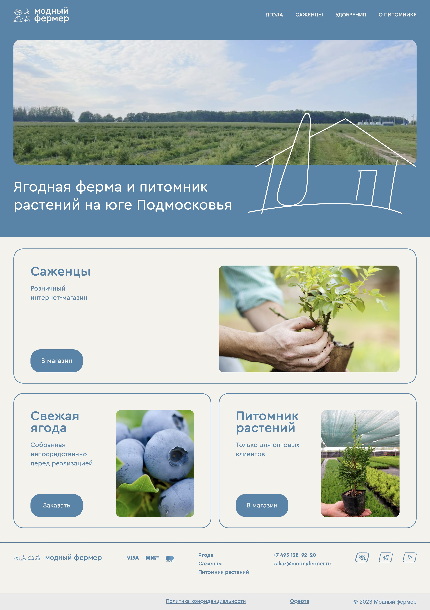
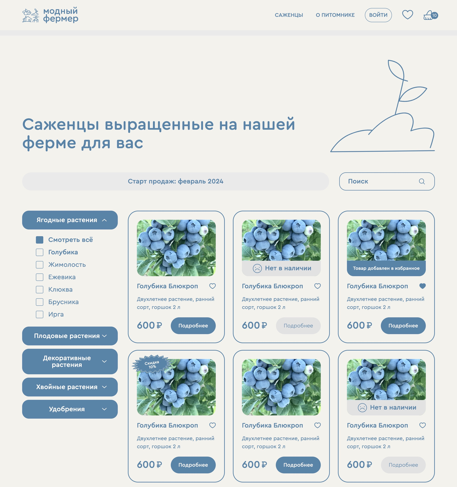
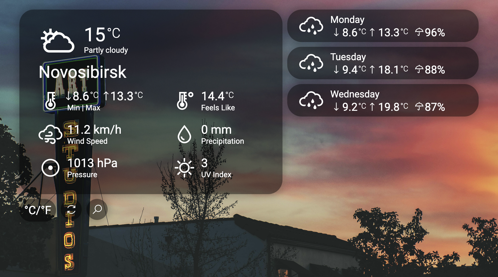
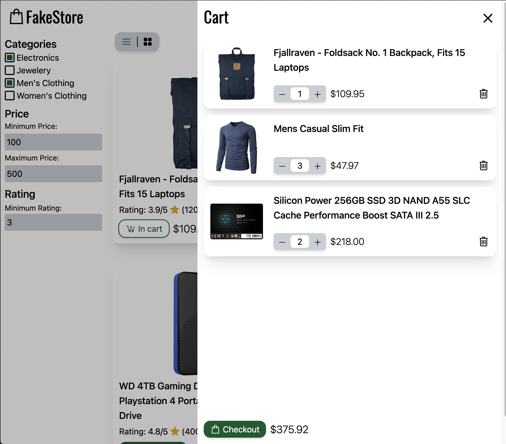
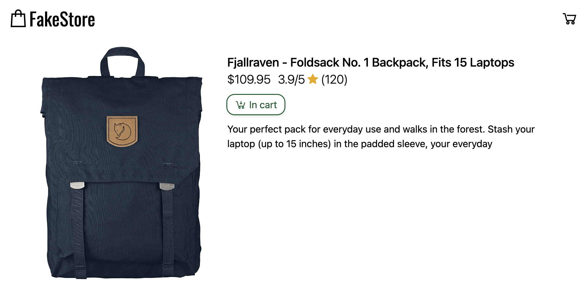

# Портфолио - Фауст Вадим

### Основные навыки

- HTML/CSS
- TypeScript/JavaScript
- React
- Vue.js/Nuxt

### Остальные известные технологии
- C/C++
- Python
- PostgreSQL

# Готовые проекты

[Sale Elki](https://sale-elki.ru/)

# Проекты в работе

### Модный Фермер

### Кладовочка

# Персональное проекты

### JS Weather

Сайт с погодой основанный на [WeatherAPI.com](http://WeatherAPI.com)

[GitHub - theVadimF/JS_Weather](https://github.com/theVadimF/JS_Weather/tree/main)

[Weather](https://thevadimf.github.io/JS_Weather/)

### Nuxt FakeStore

Сайт основанный на [fakestoreapi.com](https://fakestoreapi.com/).

[GitHub - theVadimF/Nuxt_FakeStore](https://github.com/theVadimF/Nuxt_FakeStore/tree/main)

### React Cart

[GitHub - theVadimF/React_ShoppingCart](https://github.com/theVadimF/React_ShoppingCart/tree/main)

.png)

.png)

### Калькулятор на C++

Библиотека состоящая из валидатора и вычислителя. Принимает выражение в стандартной нотации.

[GitHub - theVadimF/CPP_RPNCalc](https://github.com/theVadimF/CPP_RPNCalc/tree/main)

### Имплементация типа данных decimal в С

[GitHub - theVadimF/C_Decimal](https://github.com/theVadimF/C_Decimal/tree/main)