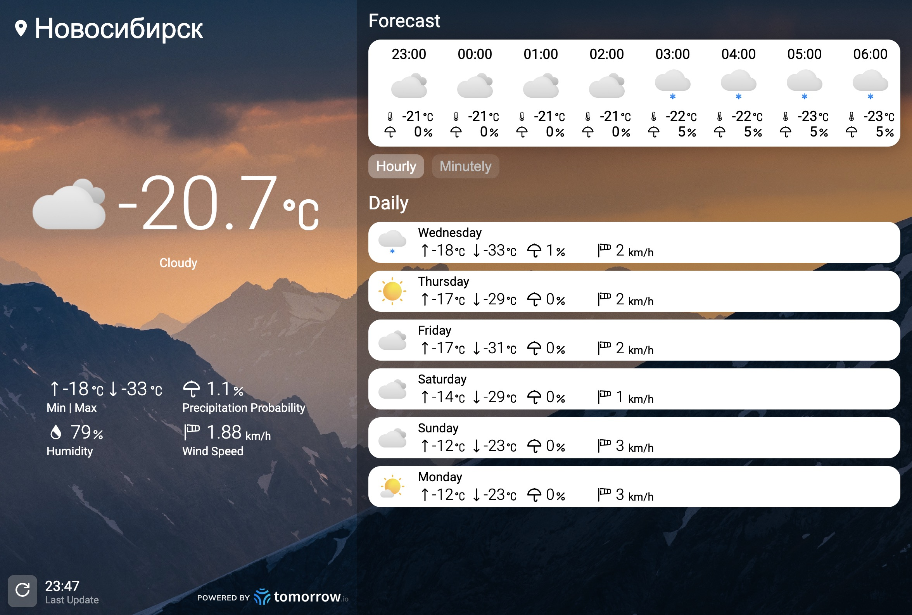

# Портфолио - Фауст Вадим

### Основные навыки

- HTML/CSS
- TypeScript/JavaScript
- SCSS
- React
- Vue.js/Nuxt

### Остальные известные технологии
- PHP
- C/C++
- Python
- PostgreSQL

# Примеры работ

### Клуб Четырёх Коней (Тестовое для Yandex Crowd)
[GitHub](https://github.com/theVadimF/yandex_crowd_test)

[Сайт](https://thevadimf.github.io/yandex_crowd_test/)

[Figma](https://www.figma.com/design/0xXfupPNU3aZxPqFbmhCKb/%D0%94%D0%B8%D0%B7%D0%B0%D0%B9%D0%BD-%D0%B4%D0%BB%D1%8F-%D0%B2%D0%B5%D1%80%D1%81%D1%82%D0%BA%D0%B8-%7C-%D0%A2%D0%B5%D1%81%D1%82%D0%BE%D0%B2%D1%8B%D0%B9-%D0%BB%D0%B5%D0%BD%D0%B4%D0%B8%D0%BD%D0%B3?m=auto&t=YSOI1kS6QUd2ROFK-1)

### Sale Elki

[Сайт](https://sale-elki.ru/)

[Github Source](https://github.com/theVadimF/sale-elki)

### Модный Фермер

[Github Source](https://github.com/theVadimF/modniyfermer)

### Кладовочка

[Github Source](https://github.com/theVadimF/kladovochka)

### FD-Plast

[Github Source](https://github.com/theVadimF/fd-plast)

# Персональное проекты

### [WIP] ReactWeather

[Github Source](https://github.com/theVadimF/ReactWeather)

### JS Weather

Сайт с погодой основанный на [WeatherAPI.com](http://WeatherAPI.com)

[GitHub - theVadimF/JS_Weather](https://github.com/theVadimF/JS_Weather/tree/main)

[Weather](https://thevadimf.github.io/JS_Weather/)

### Nuxt FakeStore

Сайт основанный на [fakestoreapi.com](https://fakestoreapi.com/).

[GitHub - theVadimF/Nuxt_FakeStore](https://github.com/theVadimF/Nuxt_FakeStore/tree/main)

### React Cart

[GitHub - theVadimF/React_ShoppingCart](https://github.com/theVadimF/React_ShoppingCart/tree/main)

.png)

.png)

### Калькулятор на C++

Библиотека состоящая из валидатора и вычислителя. Принимает выражение в стандартной нотации.

[GitHub - theVadimF/CPP_RPNCalc](https://github.com/theVadimF/CPP_RPNCalc/tree/main)

### Имплементация типа данных decimal в С

[GitHub - theVadimF/C_Decimal](https://github.com/theVadimF/C_Decimal/tree/main)